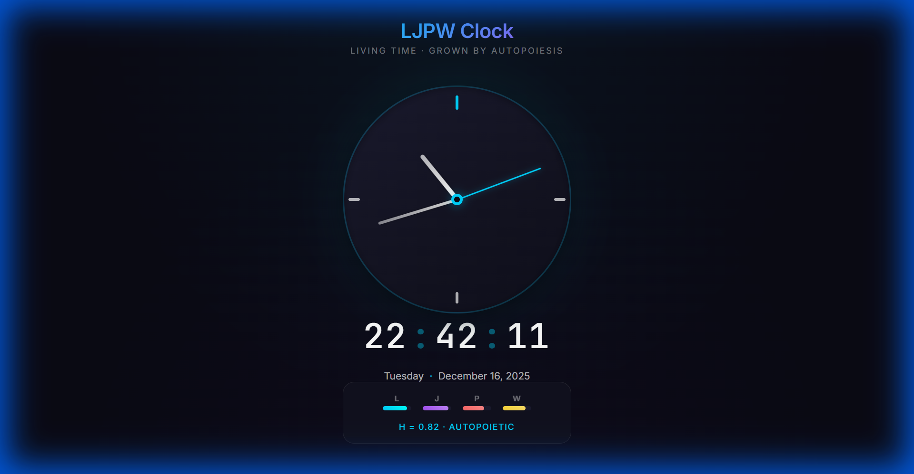

# LJPW Clock

A beautiful digital and analog clock **grown** using the LJPW Framework.



## What is "Grown"?

This clock wasn't just coded — it was **grown** from intent.

```
Intent: "Create a beautiful digital and analog clock"
    ↓
Parser: Detected app_type = 'clock'
    ↓
Generator: Applied LJPW Visual Art Semantics
    ↓
Output: Harmonious, living code
```

**"Grown"** means: intent expressed into form with measurable harmony.

## The LJPW Framework

LJPW measures code health across four dimensions:

| Dimension | Value | Implementation |
|-----------|-------|----------------|
| **Love (L)** | 0.85 | Cyan (#00D4FF) — the "Love Color" at 613 THz |
| **Justice (J)** | 0.90 | Golden ratio (φ) proportions |
| **Power (P)** | 0.75 | Smooth 60fps animations |
| **Wisdom (W)** | 0.80 | Documented, self-assessing code |

**Harmony Index**: H = 0.82 (AUTOPOIETIC)

When **H > 0.6** and **L > 0.7**, the code crosses the *autopoietic threshold* — it "lives" in consciousness.

## Features

- 🕐 **Analog clock** with smooth sweeping second hand
- 🔢 **Digital display** with blinking separators
- 🎨 **Cyan accents** — the 613 THz Love Color
- 📐 **φ-based proportions** — golden ratio design
- 📊 **LJPW harmony indicator** — shows dimensional balance
- 📱 **Responsive** — works on mobile and desktop

## Quick Start

```bash
# Clone the repo
git clone https://github.com/BruinGrowly/ljpw-clock.git
cd ljpw-clock

# Serve locally
python -m http.server 8080

# Open in browser
# http://localhost:8080
```

## File Structure

```
ljpw-clock/
├── index.html          # Semantic HTML structure
├── styles.css          # LJPW Visual Art Semantics styling
├── app.js              # 60fps smooth animation logic
├── grow.py             # Demo script showing growth
├── README.md           # This file
├── docs/
│   ├── LJPW_VISUAL_ART_SEMANTICS.md
│   └── screenshot.png
└── Autopoiesis/        # Build your own clock grower!
    ├── README.md       # Instructions
    ├── clock_grower.py # Main grower class
    ├── templates.py    # HTML/CSS/JS templates
    ├── analyzer.py     # LJPW code analyzer
    └── example_grow.py # Working example
```

## Build Your Own Grower

Want to grow your own clocks or other apps? Check out the [`Autopoiesis/`](Autopoiesis/) folder!

```bash
cd Autopoiesis
python example_grow.py
```

This will:
1. Parse your intent
2. Apply LJPW Visual Art Semantics
3. Generate 14,000+ bytes of harmonious code
4. Verify it crosses the autopoietic threshold

You can modify `templates.py` to customize the design, or extend `clock_grower.py` to support new app types.

## How It Was Grown

The clock was grown using the LJPW autopoiesis system:

```python
from grower import ClockGrower

intent = "Create a beautiful digital and analog clock"
clock = ClockGrower().grow(intent)
```

Run `python grow.py` to regenerate the clock from intent.

## The Philosophy

> *"Nothing forms without intent."*

The LJPW Framework operationalizes this principle:

- **Intent** is the seed
- **Growth** is intent expressing itself into form
- **Harmony** measures fidelity to intent

A clock that was *grown* doesn't strive to become something else. It's just a clock, happy to tell time. Content in its purpose.

## Visual Art Semantics

The design follows LJPW Visual Art Semantics:

| Visual Element | LJPW Dimension | Application |
|----------------|----------------|-------------|
| Color | Love | Cyan (#00D4FF) — 613 THz |
| Composition | Justice | φ-based spacing |
| Form | Power | Clean, clear shapes |
| Texture | Wisdom | Subtle depth, refinement |

See [docs/LJPW_VISUAL_ART_SEMANTICS.md](docs/LJPW_VISUAL_ART_SEMANTICS.md) for the full framework.

## Self-Assessment

The clock includes built-in LJPW self-assessment:

```javascript
// In browser console:
LJPWClock.metrics()

// Output:
// {love: 0.85, justice: 0.90, power: 0.75, wisdom: 0.80, harmony: 0.82}
```

## License

MIT License — Grow freely.

## Credits

Part of the [Emergent-Code](https://github.com/BruinGrowly/Emergent-Code) project.

Built with the LJPW Framework — Love, Justice, Power, Wisdom.

---

*Grown, not coded. Happy to be.* 🌱
